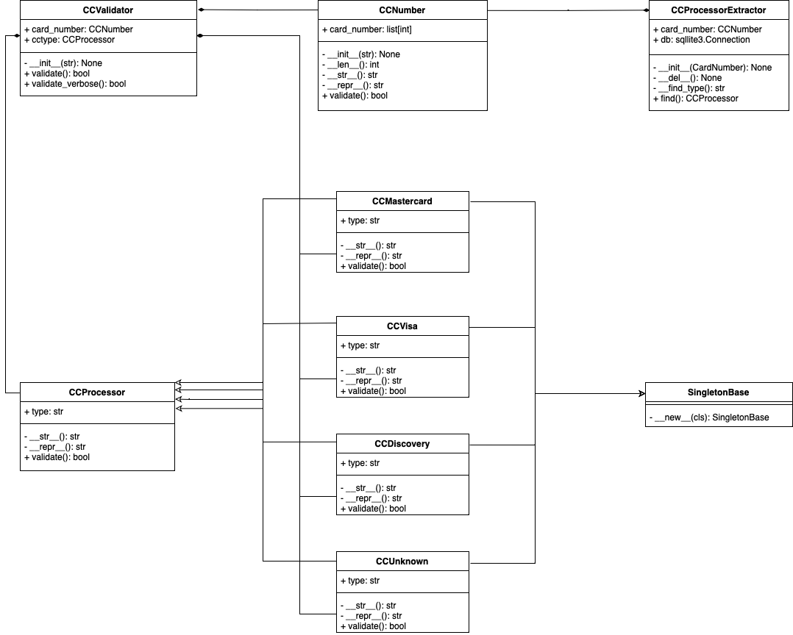
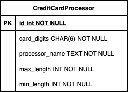

# py-credit-card-validity
A interview exercise for validating credit card numbers and credit card types (Mastercard, Discovery, and Visa).

## Design Files
- [Class Diagram](./diagrams/Class_Diagrams.png)
- [Table Diagram](./diagrams/Database_Diagram.png)

## Setup & Tools
Since this exercise is largely about testing raw skill, I did not want to venture in getting complex dependancies. All imports should be included in the standard library. The imports are provided below.
```
import os.path
import re
import sqlite3
import sys
```

### Running Program
#### Running the internal batch of cards (verbose)
```
validator.py b
```

#### Running the tool with a card number
```
validator.py c "6011552675304467"
```
```
Card number validity for 6011552675304467: True 
Card type validity for Discovery: True 
Card is valid: True
```
- With option c card numbers need to be wrapped in quotes. 


## Assumptions
- Assume we are validating credit card numbers and types, not CVV or expiration dates.
- This will be a design for implementing a program that takes in a credit card number and provideds True or False based on the validity of the card.
- For simplicity all the classes and tooling can be contain in one file. A build system is not required.

## Class Diagram


### Notes on classes
#### Subclasses of CCProcessor
- These classes are stark but they aim to be able to add additional functionality by being able to call out to a processor api specific to that processor. For the purposes of this exercise that is just validating card type and card number I have left this out. 
- In this implementation the returning of CCMastercard,CCVisa,CCDiscovery from the CCProcessorExtractor means that based on the card number a record in the database was found and thus the type for the card is valid for Mastercard, Visa, and Discovery cards. Since this exercise is about validating card number and type using external apis to validate the card with CVV and expiration dates is beyind the scope.

## Databse Diagram

### Notes on table
#### CreditCardProcessor
- For the purposes of this exercise there are only so many rows in the table so min and max length are included for each row. This could be normalized and the search query would need minor modification.
